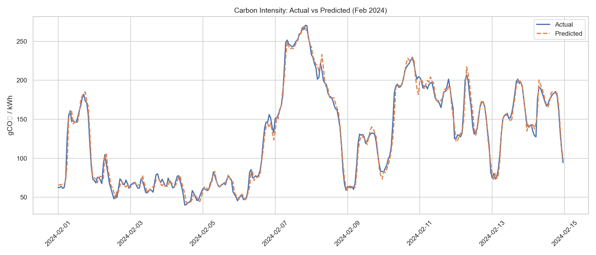
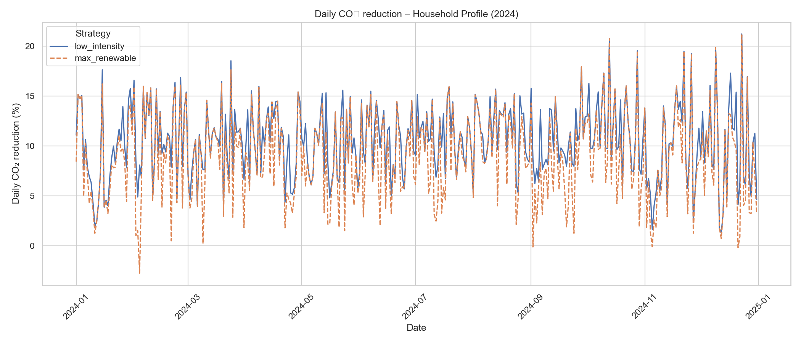
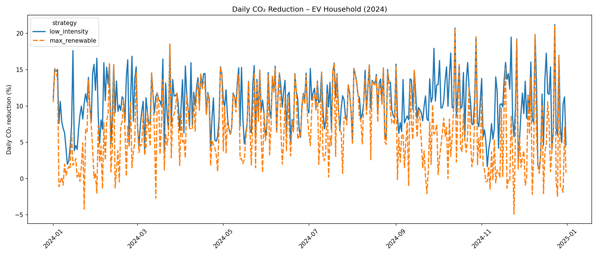
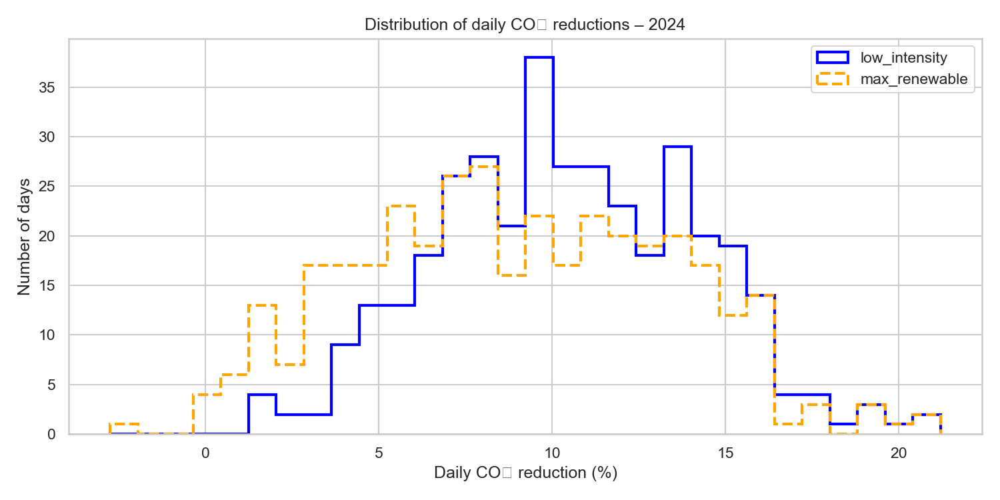
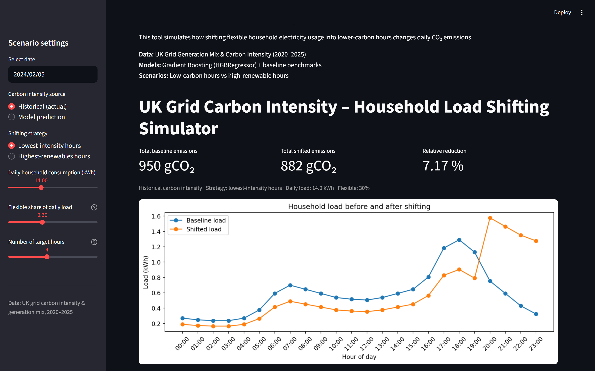

# Forecasting-UK-Grid-Carbon-Intensity
Can we predict near-term UK carbon intensity and show people that when shifting their electricity usage, it could yield a bigger CO₂ reduction?

### Project motivation ###
#### Why Carbon Intensity ####
I have long been interested in how carbon emmissions plays a role in global warming. This then led me to start questioning my own carbon footprint, the biggest of all being my house.
An average household uses between 10 - 12 kWh/per day, more in the case of a family of 4 that also includes EV charging.
Although one household shifting their carbon load to more 'off-peak- hours will have little to no difference on the energy grid, a combined effort would be substantial. The aims of this project is to prove how we can all save on energy, as well as shifting our carbon loads to more tailored hours of the day, when the grid is much less in demand. However, this is not as simple as 'just set your washing machine to 3am start'. The predictions are both more subtle, and customisable using the app, to create a realistic expectation.

#### Data sources: ####
Historic generation mix and carbon intensity
Temperature Observations

Pipeline:
1. Pull raw data (carbon intensity, generation mix, temperature)
2. Clean and standardise data, including timestamps
3. Merge into unified hourly dataset
4. Feature engineering (lags, rolling windows, weather features)
5. Train and validate forecasting models
6. Generate scenario-based CO₂ calculations

### Workflow ###

        ┌──────────────────┐
        │  Raw data (CI,   │
        │  generation mix) │
        └─────────┬────────┘
                  │
     ┌────────────▼──────────────┐
     │   Data cleaning & merge   │
     │ (timestamps, resampling)  │
     └────────────┬──────────────┘
                  │
     ┌────────────▼──────────────┐
     │  Exploratory Data Analysis│
     └────────────┬──────────────┘
                  │
     ┌────────────▼──────────────┐
     │  Baseline models          │
     │  (t-1, t-24, t-168)       │
     └────────────┬──────────────┘
                  │
     ┌────────────▼──────────────┐
     │  HGB forecasting model    │
     └────────────┬──────────────┘
                  │
     ┌────────────▼──────────────┐
     │  Household scenario engine│
     └────────────┬──────────────┘
                  │
     ┌────────────▼──────────────┐
     │  Streamlit app            │
     └───────────────────────────┘

## Discussion and Limitations
### Structural insight: decarbonisation compresses the benefit of load shifting

The analysis shows that domestic load shifting delivers modest but consistent
CO₂ savings for a standard high-usage household (14 kWh/day, 30% flexible load):

- Mean daily reduction: **1.6%**
- Best days: up to **5%**
- Worst days: down to **–2.5%**

The key reason is structural rather than methodological:

- In the modern UK grid (2020 - 2025), **renewables dominate low-carbon periods**
- As a result, the hours with the highest renewable share are essentially the same
  hours with the lowest carbon intensity
- This makes the **low_intensity** and **max_renewable** strategies almost indistinguishable
  for a standard household profile

In earlier, coal- and gas-heavy years, the spread between high- and low-carbon hours
was larger, and the theoretical benefit of shifting would have been higher. In that
sense, the relatively small gains observed here are a symptom of progress:
a cleaner, more stable grid leaves less 'low-hanging fruit' for demand shifting.

### EV owner scenario: timing matters much more

To reflect a more realistic modern energy profile, the analysis also includes
an EV owner scenario. Here the household still uses 14 kWh/day, but adds
an EV charging load of around 7 kWh/day, which is treated as highly flexible
and constrained mainly to evening and night hours.

Under the same grid conditions (2024) and with 30% flexible household load:

- **Standard household (no EV, low_intensity strategy)**  
  - Mean daily CO₂ reduction: **1.6%**  
  - Best days: **5%**

- **EV owner (7 kWh/day charging, low_intensity strategy)**  
  - Mean daily CO₂ reduction: **10.5%**  
  - Best days: above **20%**

In other words, adding a realistic EV charging profile increases the
average load-shifting benefit by roughly an order of magnitude. The reason
is simple: EV charging is a large, highly flexible load that can be moved
almost entirely into the cleanest hours.

The strategy comparison is also revealing:

- The **low_intensity** strategy (targeting the lowest carbon intensity hours)
  delivers the highest mean reduction and never increases emissions in this EV setup.
- The **max_renewable** strategy (targeting hours with the highest renewable share)
  still works on average, but:
  - has a lower mean reduction, and
  - occasionally *increases* emissions on some days (down to –2.8%)

This suggests that for large flexible loads like EV charging, it is more robust
to **optimise directly for carbon intensity** than to chase 'high-renewables' periods
as a proxy.

### When shifting can make things worse

The presence of negative daily reductions in the standard household case
(down to around –2.5%) is not a modelling artefact. On some days:

- The carbon intensity curve is flat, or
- The household load profile is out of phase with clean periods

Under those conditions, naively shifting a fraction of demand into nominally
'better' hours can increase total emissions.

This is also visible in the EV scenario when using a max_renewable rule:
on a minority of days, prioritising renewable share over actual carbon intensity
misaligns the charging window with the true cleanest hours.

Overall, this suggests that load shifting **should not** be applied as a static rule
(e.g. 'always run appliances at night' or 'always charge when renewables are high'),
but instead be driven by **dynamic, day-ahead signals** based on actual forecasted
intensity.

### Scope and limitations

This analysis is explicitly scoped to:

- A standard high-usage household profile (14 kWh/day)
- An EV owner variant with an additional 7 kWh/day of flexible charging
- 30% flexible demand on the household side, representing appliances such as
  laundry, dishwashers, and some discretionary usage
- The 2024 UK grid, using historic carbon intensity and renewable mix

Key limitations:

- No modelling of intraday behaviour changes (behavioural rebound is ignored)
- No explicit treatment of network constraints or locational marginal emissions
- Flexible share is assumed homogeneous and perfectly controllable
- EV charging is simplified as a single, daily charging window
- Shifting is evaluated day-by-day, not as part of a portfolio of households or
  aggregated flexibility markets

Despite these simplifications, the results are consistent with the physical
behaviour of a decarbonising grid and provide a realistic comparison between:

- modest, but consistent savings for a standard household, and
- significantly larger savings for EV owners when charging is aligned with
  the cleanest hours based on carbon intensity forecasts.

**Key Results**
### **Forecasting**

- Naive baseline (t-1): 8.7 MAE  
- Daily baseline (t-24): 38 MAE  
- Weekly baseline (t-168): 56 MAE  
- HGBRegressor: 5.9 MAE  

Two-week slice showing the model’s ability to follow real carbon intensity patterns.

The machine-learning model outperforms all baselines meaningfully, reducing error by **32% vs naive**.

### **Scenario Analysis (Household CO₂ Impact)**

Using:

- **14 kWh/day** high-usage household  
- **30% flexible load** (4.2 kWh)  
- Shifting into **4 cleanest hours** of each day  
- Year: **2024**  

Daily CO₂ reduction under household load-shifting (2024). Most days show 1–2% savings, with best days reaching around 5% and occasional negative days when shifting increases emissions.

Results:

| Metric                  | Value |
|-------------------------|-------|
| **Mean daily reduction** | **1.65%** |
| **Max daily reduction**  | **4.93%** |
| **Min daily reduction**  | **-2.51%** |
| **Strategies identical** | Yes |

### EV Household Scenario (14 kWh/day + 7 kWh EV charging)

To model a more realistic modern energy profile, a second scenario was added for
an EV owner charging approximately 7 kWh/day. Because EV charging is a large and
highly flexible load, shifting it into the cleanest hours has a significantly
larger impact than in a standard household.

**Key results (2024):**

| Metric | Value |
|--------|--------|
| Mean daily reduction | **10.48%** |
| Max daily reduction | **21.21%** |
| Min daily reduction | **1.26%** |
| Strategies identical | No - low_intensity performs better and is more consistent |

**Interpretation:**  
For EV owners, intelligent timing has an order-of-magnitude larger CO₂ impact.
The low_intensity strategy is consistently beneficial, while the max_renewable
strategy occasionally increases emissions.

Daily CO₂ reductions for an EV owner (2024). Most days show 8 - 12% savings, with the cleanest days exceeding 20%.

### Why are both strategies identical?

- The hours with the **lowest carbon intensity** are the same hours with the **highest renewable penetration**.
- In a decarbonising grid, renewables shape the cleanest periods.
- Therefore:  
  **'Shift to renewable hours' = 'Shift to low-carbon hours'**

### Why are reductions modest?

Because the modern UK grid (2020 - 2025) has:

- flatter carbon intensity curves  
- high renewable penetration  
- fewer deep fossil-fuel peaks  

Small gradients = small opportunity for shifting.

Even so, a 1 - 2% reduction **per household** scales to hundreds of thousands of tonnes of CO₂ annually at the national level.

Distribution of daily CO₂ reductions. The distribution centers near 1.6%, with a right tail up towards 5% and a left tail down to -2.5%, demonstrating days when shifting increases emissions.

**Discussion & Limitations**
### Structural insight:  
**Decarbonisation compresses the benefit of load shifting.**

- Renewables dominate the cleanest periods  
- The two strategies collapse into the same behaviour  
- Grid is smoother → fewer 'dirty peaks' → less advantage from timing shifts  

### Negative savings

Some days see **higher emissions** after shifting:

- Flat carbon intensity profiles  
- Household load out of phase with clean hours  

Dynamic signals are required - not static 'off-peak' rules.

### Scope limitations

- Single household profile (14 kWh/day)  
- 30% flexible load  
- No temperature or weather exogenous variables  
- No behavioural rebound  
- No locational marginal emissions  
- Evaluated nationally, not regionally  

Despite this, the model aligns with power-system behaviour and gives a realistic upper bound on household load-shifting impact.

**Running the Streamlit App**
### Install dependencies
### Run the app

Interactive Streamlit application for exploring UK grid carbon intensity forecasts and household CO₂ reduction scenarios. Users can adjust dates, flexible load share, and demand settings to generate personalised results. The app opens automatically in your browser.

Try the interactive app here:
https://forecasting-uk-grid-carbon-intensity.streamlit.app/

It allows users to:

- select a date (actual or model-predicted carbon intensity)  
- adjust daily consumption  
- adjust flexible share  
- choose shift strategy  
- view load, emissions, and CO₂ reduction  

**Future Enhancements**

- Temperature + weather regressors (improve forecasts)  
- LightGBM model for comparison  
- SHAP explainability  
- 48-hour forecasting  
- EV charging + heat-pump household profiles  
- Dynamic demand-flexibility simulation  
- Deployment to Streamlit Cloud  

**License**

MIT License  
Free for use and adaptation.